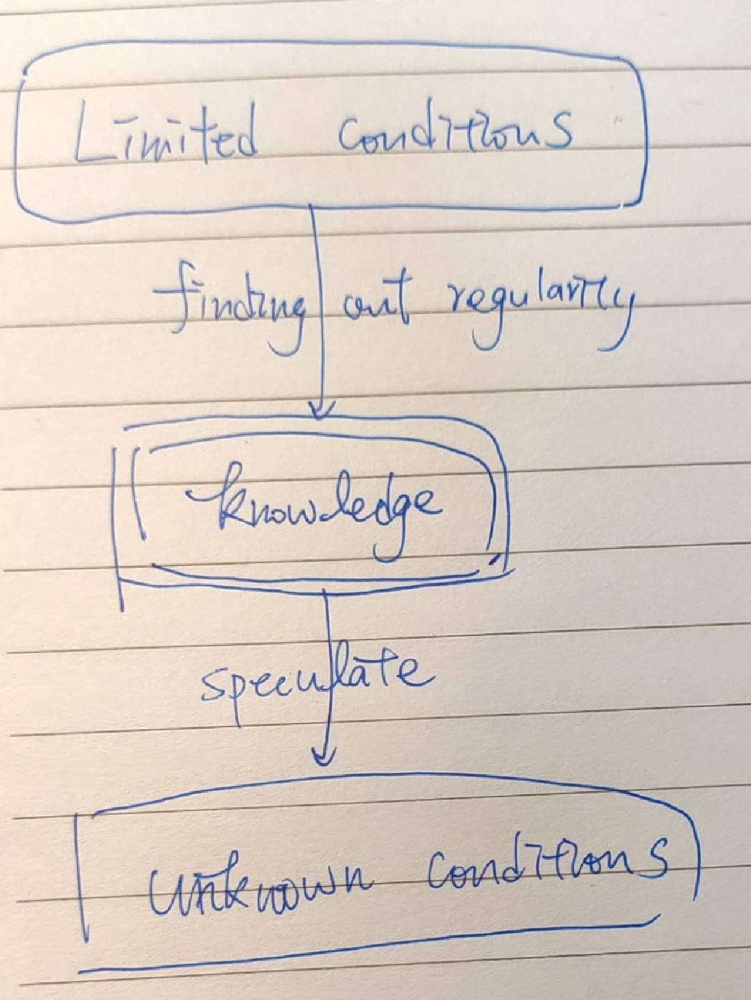

# What is learning

## Memorization

There are many people who performed well when they are elementary school students. However, Their grades begin to drop down after turning to junior high.

The reason is that the knowledge we need in elementary school, was mostly base on **memorization**, so we can get good grade by memorizing things.

For example, we learn 9 - 9 multiplication table by memorizing it, there are most only 81 result in the table.

The disadvantages ot memorization are, there is limited capacity in our brain, and also we can hardly come up with all of the posibilities.

## Learning

`Learning is a process of finding out the regularity.`

To be more specific, learning is the process of finding out the regularity between **limited problems and answers**

And the regularity, is called **knowledge**.

> If you can't explain something in simple terms, you don't understand it. -- Richard Philip Feynman

`Learning is also the process of using knowledge to compress information.`

